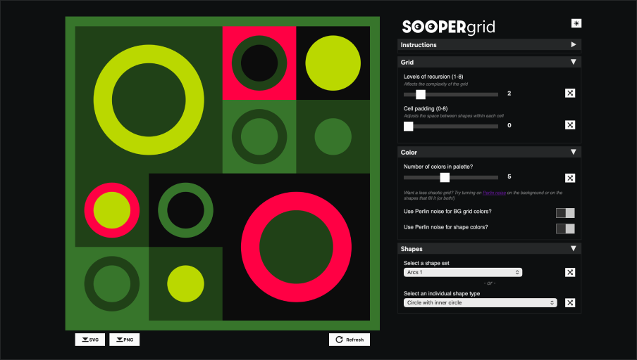
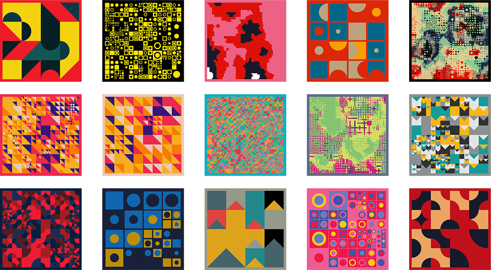

SOOPERgrid is an interactive tool for creating dynamic grid-based compositions. The recursive grid creation algorithm generates endless variations of layouts, each with unique color palettes and geometric arrangements.

**<a href="https://soopergrid.com" target="_blank">Click here to open SOOPERgrid in a new window</a>**

Features include:

- Real-time generation with customizable parameters
- Export functionality (SVG & PNG)
- Random color palettes (2-9 colors in each palette)
- Shape and pattern variants

Built with <a href="https://p5.js" target="_blank">P5.js</a>, I created SOOPERgrid to explore recursive grids and how to create custom tools to make art that can be exported as SVG assets for post-processing elsewhere. 

SOOPERgrid is open source, you can clone, modify, and make SOOPERgrid your own. Go check it out on <a href="https://github.com/ursooperduper/sooper-grid" target="_blank">Github</a>.

<a href="https://github.com/ursooperduper/sooper-grid" class="gh-card" target="_blank" rel="noopener noreferrer">
  

    
      ursooperduper/<strong>sooper-grid</strong>
    
    <svg class="gh-github-icon" width="24" height="24" viewBox="0 0 24 24" fill="currentColor" aria-hidden="true">
      <path d="M12 1C5.9225 1 1 5.9225 1 12C1 16.8675 4.14875 20.9787 8.52125 22.4362C9.07125 22.5325 9.2775 22.2025 9.2775 21.9137C9.2775 21.6525 9.26375 20.7862 9.26375 19.865C6.5 20.3737 5.785 19.1912 5.565 18.5725C5.44125 18.2562 4.905 17.28 4.4375 17.0187C4.0525 16.8125 3.5025 16.3037 4.42375 16.29C5.29 16.2762 5.90875 17.0875 6.115 17.4175C7.105 19.0812 8.68625 18.6137 9.31875 18.325C9.415 17.61 9.70375 17.1287 10.02 16.8537C7.5725 16.5787 5.015 15.63 5.015 11.4225C5.015 10.2262 5.44125 9.23625 6.1425 8.46625C6.0325 8.19125 5.6475 7.06375 6.2525 5.55125C6.2525 5.55125 7.17375 5.2625 9.2775 6.67875C10.1575 6.43125 11.0925 6.3075 12.0275 6.3075C12.9625 6.3075 13.8975 6.43125 14.7775 6.67875C16.8813 5.24875 17.8025 5.55125 17.8025 5.55125C18.4075 7.06375 18.0225 8.19125 17.9125 8.46625C18.6138 9.23625 19.04 10.2125 19.04 11.4225C19.04 15.6437 16.4688 16.5787 14.0213 16.8537C14.42 17.1975 14.7638 17.8575 14.7638 18.8887C14.7638 20.36 14.75 21.5425 14.75 21.9137C14.75 22.2025 14.9563 22.5462 15.5063 22.4362C19.8513 20.9787 23 16.8537 23 12C23 5.9225 18.0775 1 12 1Z"></path>
    </svg>
  

</a>

