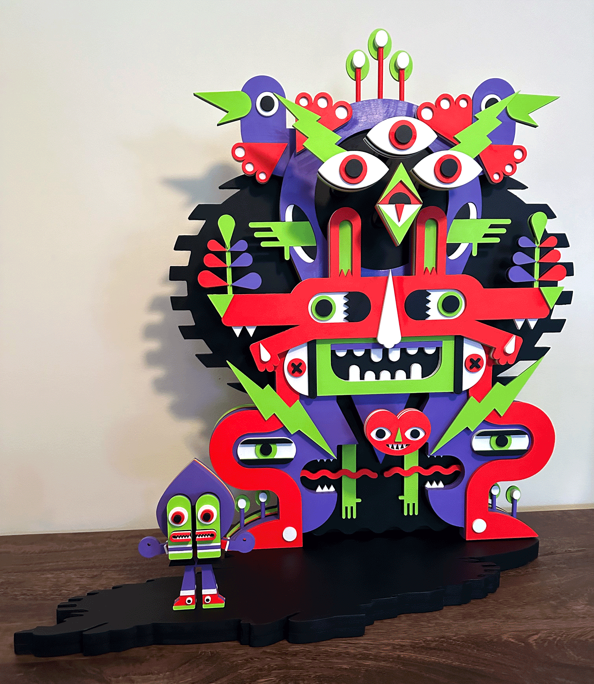
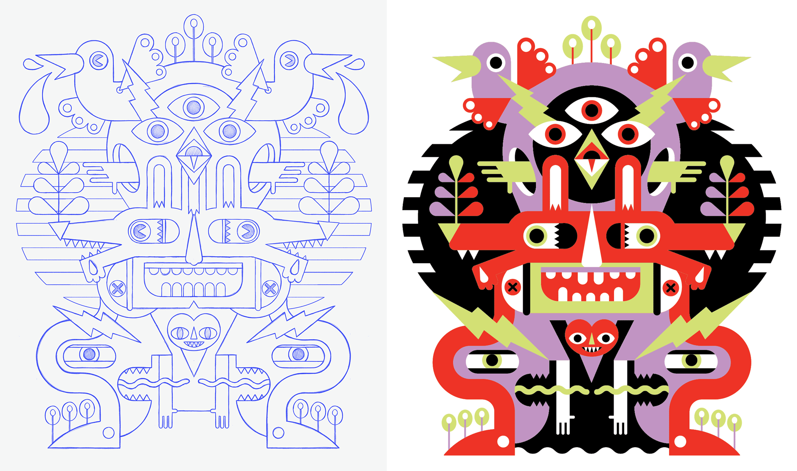
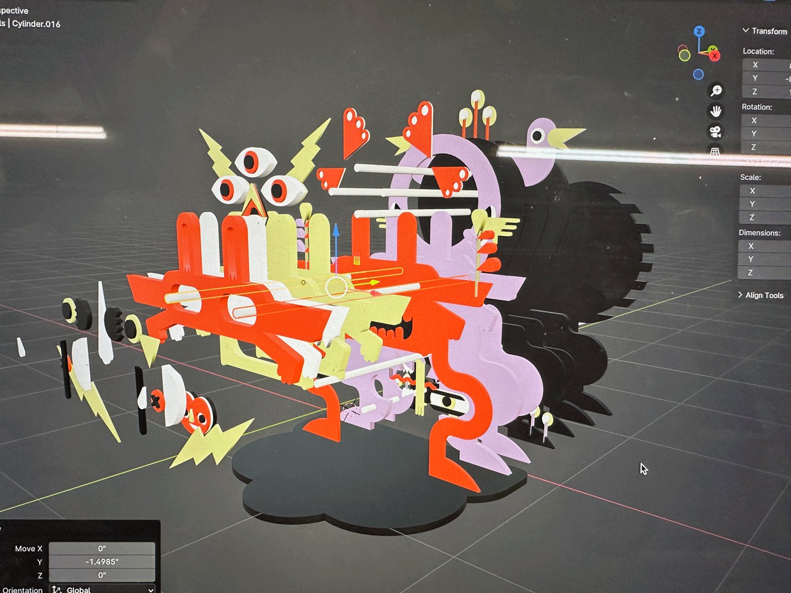
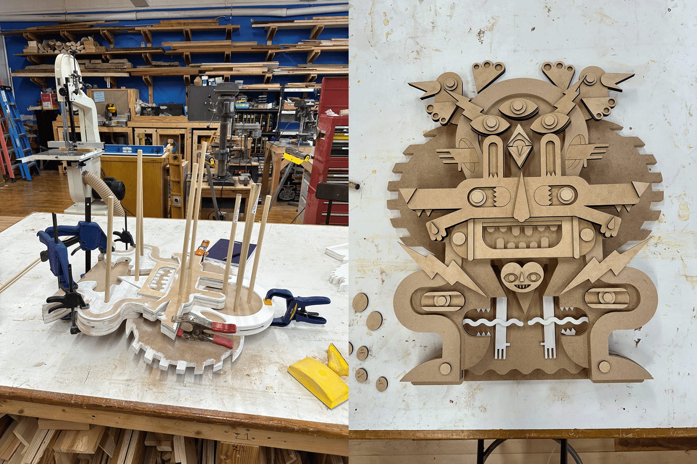
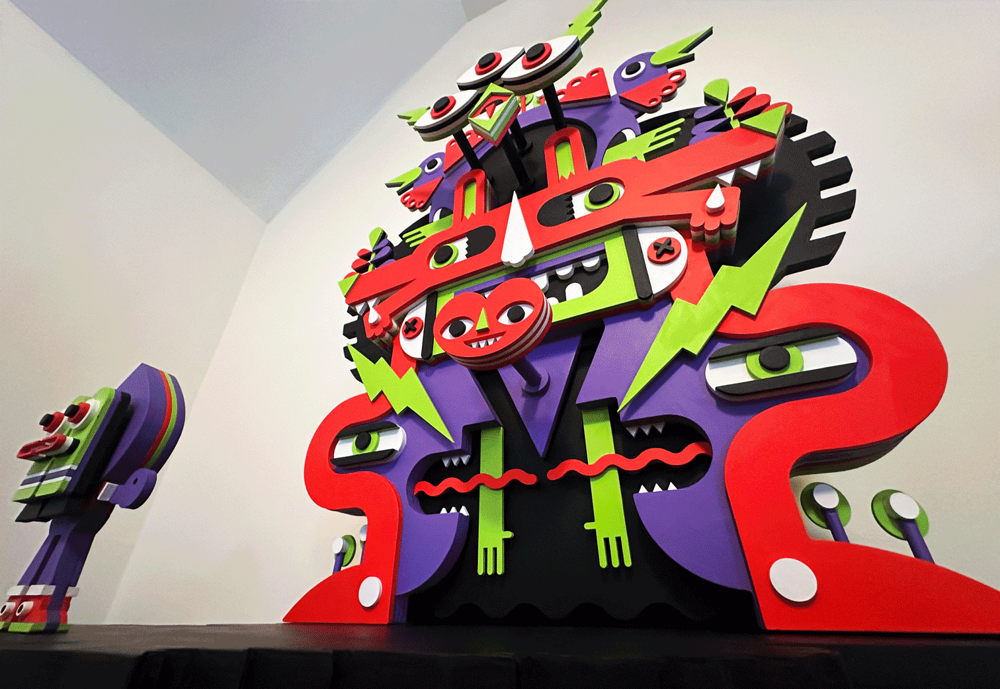
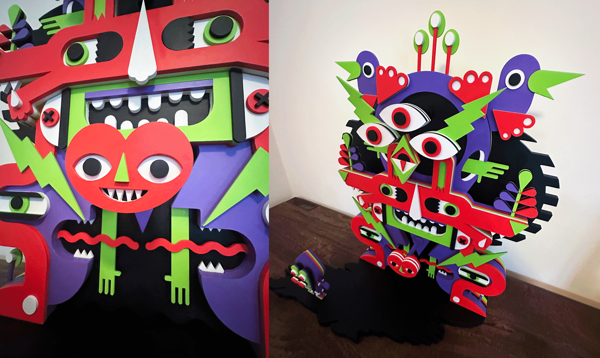
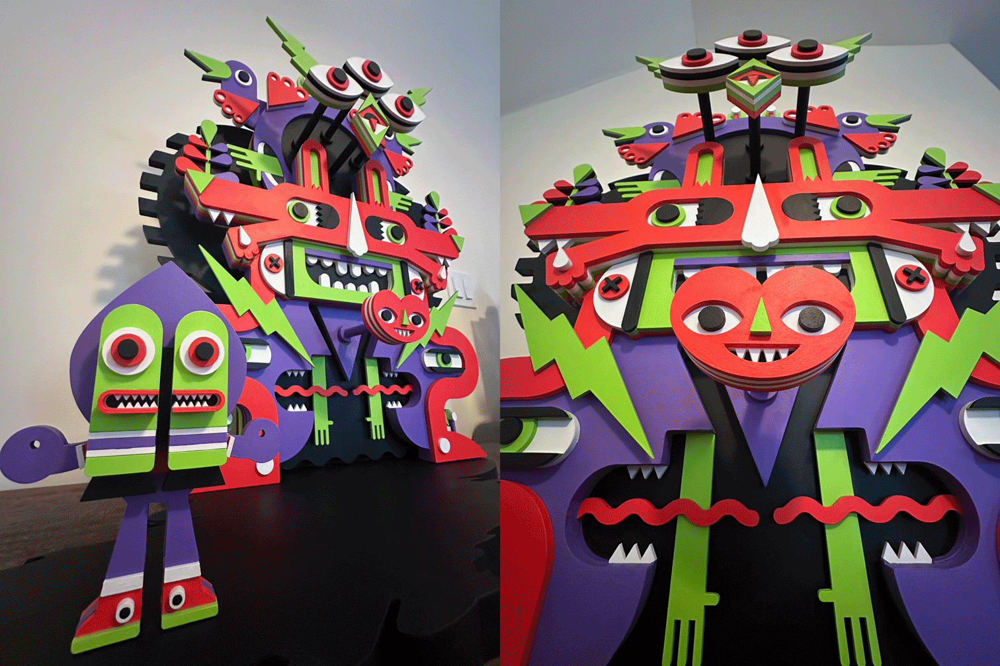

This project explores themes of visibility and recognition through character design and sculptural work. The piece invites viewers to consider how we perceive and acknowledge each other in our daily interactions.

Originally conceived as a digital illustration, after gaining access to a CNC machine at my local makerspace, I decided to convert the piece into a sculpture to bring more dimension to my typically flat illustration style. 

All my illustrations begin as pencil sketches in Adobe Fresco where I explore themes and design systems around shape, symmetry, and layout. Once the pencil sketches are complete, the illustration is transferred to a vector drawing app where it's redrawn as vectors and color palettes are defined and vector exports are created.

With exported vector assets, a 3D mockup of the illustration was created to visualize and plan the structure and build-out of the sculpture.

The individual pieces for the sculpture were cut out of MDF and sanded, primed, and hand-painted. 

Standing at 3.5 feet tall this is the largest character sculpture I've built to date and will certainly lead to more sculptural character explorations.