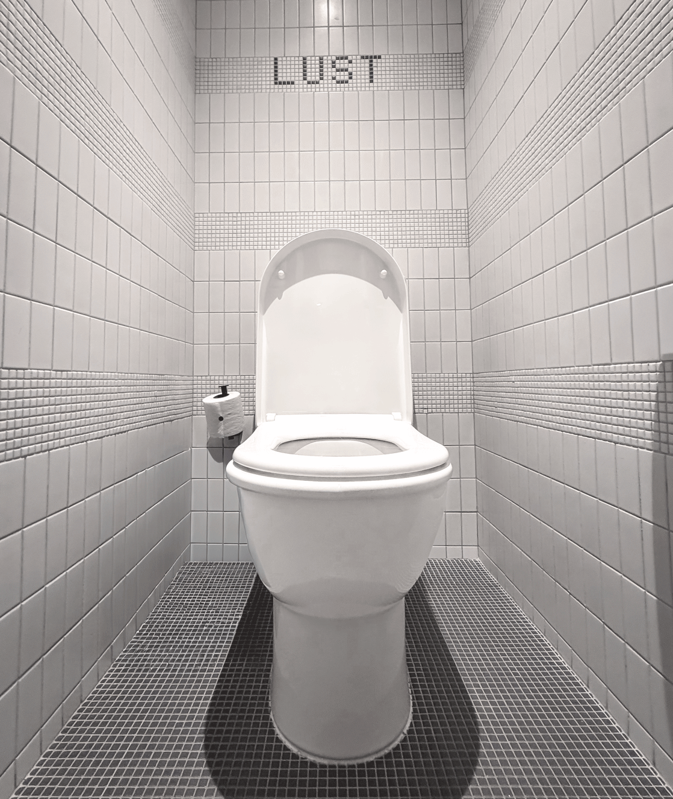

Moxtile Variable draws inspiration from the distinctive geometric tile patterns found in the guest rooms the Moxy Chelsea hotel in New York City. 

The variable font design captures the playful yet sophisticated aesthetic and then expands it to explore how adding more axes like rotation and slant can add additional playfulness and dynamism to such a fun tile-influenced font.

The variable axes include:
- Width: Condensed to extended letterforms
- Slant: Upright to slanted characters
- Height: Compressed to tall proportions
- Rotation: Rotational character variations

_More information and design details about Moxtile coming soon._

  <h3>Test Your Own Text</h3>
  
  <!-- Custom Text Input -->
  <textarea id="customText" placeholder="Type your text here..." style="font-family: 'Moxtile Variable', sans-serif;">Hamburgefonstiv</textarea>
  
  <!-- Variable Font Controls -->
  

    

      <label for="widthAxis">Width: 0</label>
      <input type="range" id="widthAxis" min="-100" max="100" value="0" step="5">
    

    

      <label for="slantAxis">Slant: 0</label>
      <input type="range" id="slantAxis" min="-100" max="100" value="0" step="5">
    

    

      <label for="heightAxis">Height: 0</label>
      <input type="range" id="heightAxis" min="-100" max="100" value="0" step="5">
    

    

      <label for="rotationAxis">Rotation: 0</label>
      <input type="range" id="rotationAxis" min="-100" max="100" value="0" step="5">
    

    

      <label for="fontSize">Size:</label>
      <select id="fontSize">
        <option value="16">16px</option>
        <option value="18">18px</option>
        <option value="24">24px</option>
        <option value="40" selected>40px</option>
        <option value="56">56px</option>
        <option value="64">64px</option>
        <option value="72">72px</option>
        <option value="80">80px</option>
        <option value="128">128px</option>
        <option value="256">256px</option>
      </select>
    

    

      <label for="lineHeight">Line Height: 1.4</label>
      <input type="range" id="lineHeight" min="0.8" max="3" step="0.1" value="1.4">
    

    

      <label for="letterSpacing">Letter Spacing: 0em</label>
      <input type="range" id="letterSpacing" min="-0.1" max="0.5" step="0.01" value="0">
    

  

  <!-- Preview -->
  

    
Hamburgefonstiv

  

