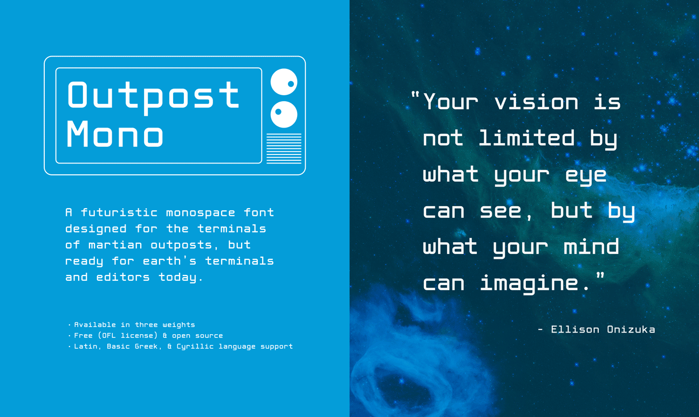
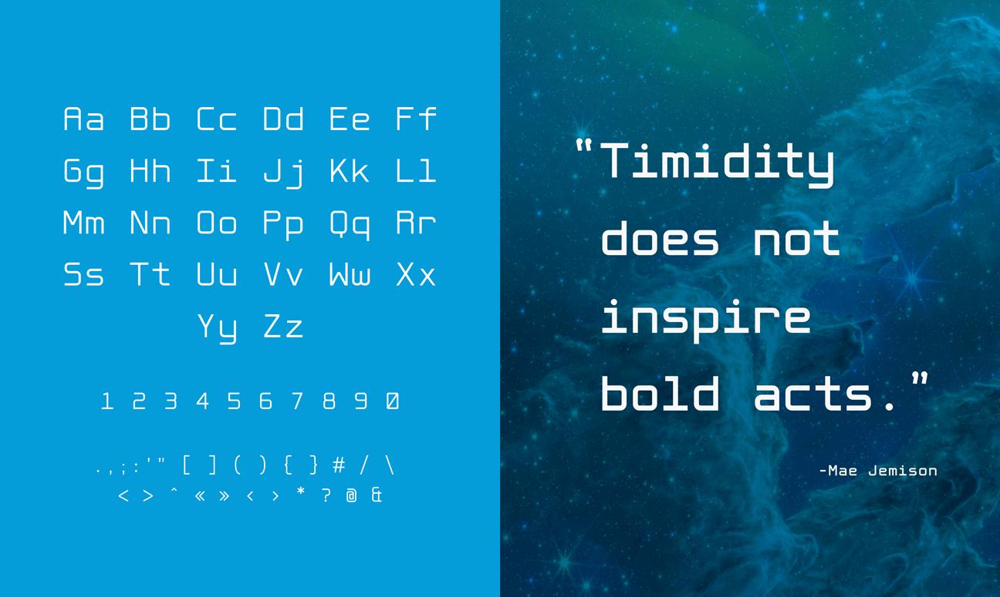
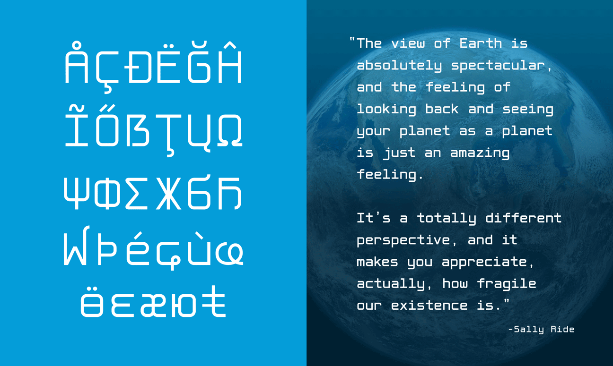
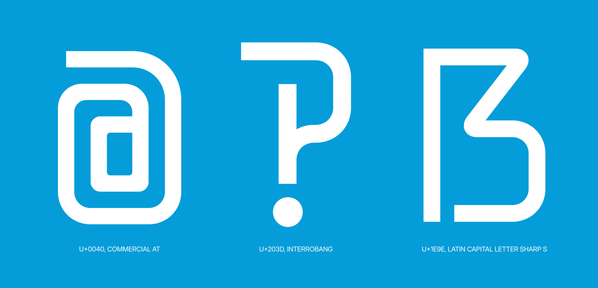

Outpost Mono is a technical monospaced typeface designed with space exploration themes in mind. It's a futuristic monospace font designed for the terminals of martian outposts, but ready for earth's terminals and editors today.

Key features:
- Open source (SIL Open Font License)
- Available in three weights Light, Regular, and Bold
- Support for Latin, Cyrillic, and basic Greek languages

Outpost Mono was 

Outpost Mono is open source, you can clone, modify, and make Outpost Mono your own. Or just download the font itself and use it in your terminal, editor, or next orbital communiqué. Go check it out on <a href="https://github.com/ursooperduper/outpost-mono" target="_blank">Github</a>.

  <h3>Test Your Own Text</h3>
  
  <!-- Custom Text Input -->
  <textarea id="customText" placeholder="Type your text here..." style="font-family: 'Outpost Mono', monospace;">Hamburgefonstiv</textarea>
  
  <!-- Font Controls -->
  

    

      <label for="fontWeight">Weight:</label>
      <select id="fontWeight">
        <option value="300">Light</option>
        <option value="400" selected>Regular</option>
        <option value="700">Bold</option>
      </select>
    

    

      <label for="fontSize">Size:</label>
      <select id="fontSize">
        <option value="16">16px</option>
        <option value="18">18px</option>
        <option value="24">24px</option>
        <option value="40" selected>40px</option>
        <option value="56">56px</option>
        <option value="64">64px</option>
        <option value="72">72px</option>
        <option value="80">80px</option>
        <option value="128">128px</option>
        <option value="256">256px</option>
      </select>
    

    

      <label for="lineHeight">Line Height: 1.4</label>
      <input type="range" id="lineHeight" min="0.8" max="3" step="0.1" value="1.4">
    

    

      <label for="letterSpacing">Letter Spacing: 0em</label>
      <input type="range" id="letterSpacing" min="-0.1" max="0.5" step="0.01" value="0">
    

  

  <!-- Preview -->
  

    
Hamburgefonstiv

  

::github{repo="ursooperduper/outpost-mono"}